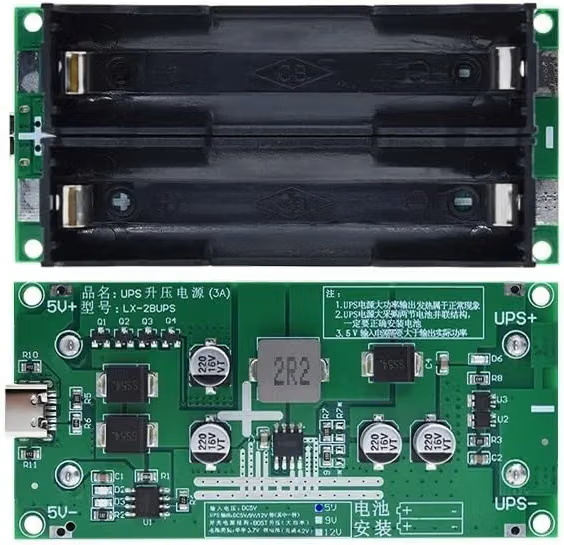
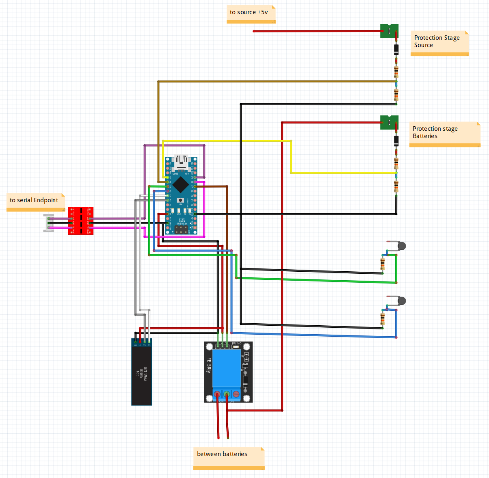

# 🛠️ Guida alla Ricreazione Hardware (PiShield BMS)

Questa guida illustra come assemblare e ricreare l'hardware del sistema **PiShield BMS** seguendo il diagramma di cablaggio ed eseguendo le modifiche necessarie sul modulo UPS base.

> [!WARNING]
> **Work In Progress (WIP)**: Il progetto è in fase di affinamento. La custodia / enclosure stampata in 3D progettata per alloggiare l'intera elettronica è stata prototipata ma non ha ancora raggiunto una maturità progettuale idonea per la pubblicazione (versione definitiva in corso di perfezionamento).

---

## 📦 Bill of Materials (BOM)

| Item | Qty | Specifiche / Descrizione |
| :--- | :---: | :--- |
| **Resistenze 10kΩ** | 4 | Resistenze a strato metallico per i partitori di tensione analogici (A0 e A1) |
| **Resistenze 100kΩ** | 2 | Resistenze fisse per i partitori dei termistori NTC |
| **Termistori NTC 100kΩ** | 2 | Termistori NTC NTC-104 (BETA 3950) per monitoraggio temperatura celle |
| **Fusibili PPTC Autoripristinanti** | 2 | Fusibili PPTC siglati `X16 CF110` (1.1A / 16V) per stadio di protezione ingressi |
| **Diodi Schottky 1N5819** | 2 | Diodi Schottky `1N5819` per protezione da tensioni inverse sui canali ADC |
| **Modulo Relè 5V (KY-019)** | 1 | Modulo relè 5V optoisolato per lo sgancio fisico delle batterie |
| **Display OLED I2C 128x32** | 1 | Display SSD1306 I2C per interfaccia utente locale |
| **Modulo Mini UPS (LX-2BUPS)** | 1 | Scheda UPS 3A / 5V boost con alloggiamento per 2x 18650 in parallelo |
| **Arduino Nano V3** | 1 | Microcontrollore ATmega328P (logica 5V) |
| **Logic Level Shifter (CYT1076)** | 1 | Convertitore di livello logico bidirezionale 3.3V <-> 5V a 4 canali per bus UART |
| **Modulo Uscita USB-C Breakout** | 1 | Modulo USB-C con resistenze 56kΩ su CC1 e CC2 (configurazione 3A Source) |
| **Condensatore ceramico 0.1µF** | 1 | Condensatore di disaccoppiamento tra VCC e GND su Arduino Nano |
| **Resistenza 1kΩ** | 1 | Resistenza in serie sulla linea seriale TX Arduino -> Level Shifter |
| **Nastro Kapton e Cavi di Potenza** | - | Nastro isolante Kapton e cavi AWG18-20 (potenza) e AWG24-26 (segnali) |

---

## 📸 Componenti e Diagramma di Cablaggio

### Modulo Mini UPS di Base (LX-2BUPS)

### Schema Elettrico Globale

---

## 🔬 Saldature e Modifiche Hardware Custom

Per integrare la logica BMS ed il relè di protezione con il modulo UPS base (LX-2BUPS), è necessario eseguire le seguenti modifiche hardware:

### 1. Dissaldatura dai Moduli Originali
1. **Contatti Batterie**: Dissaldare con cura le linguette o i contatti a molla originali delle batterie dal PCB dell'UPS LX-2BUPS (o intercettare i terminali del connettore batteria).
2. **Uscita 5V Originale**: Dissaldare i pin/connettori d'uscita 5V dal PCB dell'UPS per reindirizzarli al modulo USB-C dedicato.

### 2. Collegamento del Relè di Sgancio (KY-019)
* Saldare cavi di potenza con sezione adeguata (**AWG 18-20**) tra il polo positivo del pacco batterie (2x 18650) ed i morsetti `COM` e `NO` del relè KY-019.
* **Sicurezza del Pacco Batterie in Parallelo**:
  > [!NOTE]
  > L'analisi del PCB del modulo LX-2BUPS conferma che le due celle 18650 sono collegate nativamente in **parallelo puro** alla stessa linea di carica/scarica. È quindi del tutto sicuro interrompere il polo positivo comune del ramo batterie tramite il relè: il modulo continuerà a gestire il bilanciamento passivo e la carica/scarica in modo bilanciato senza rischiare sbilanciamenti di cella.

### 3. Modulo Uscita USB-C con Configurazione 3A (Source)
* Collegare le piazzole di uscita 5V boost del modulo UPS (`UPS+` e `UPS-`) agli ingressi di alimentazione del modulo USB-C breakout.
* Assicurarsi che sul breakout USB-C i pin **CC1** e **CC2** siano pull-uppati a VCC tramite resistenze da **56kΩ**. Questa configurazione informa il carico (ad esempio una Raspberry Pi 4 o 5 gestita come *Sink*) che la sorgente USB-C è in grado di erogare fino a **3A a 5V**.

### 4. Stadi di Protezione Ingressi Analogici Arduino
Realizzare i due stadi di protezione (per la sorgente di rete e per la batteria) facendo riferimento al [Diagramma di Cablaggio](#schema-elettrico-globale):

* **Ingresso Rete**: Collegare il polo positivo dell'ingresso USB-C principale allo stadio di protezione Sorgente (PPTC `X16 CF110` -> Diodo `1N5819` -> partitore 10kΩ/10kΩ) con punto di misura collegato al pin `PINRETE` (**A1** Arduino).
* **Ingresso Batteria**: Collegare il polo positivo a valle del relè allo stadio di protezione Batterie (PPTC `X16 CF110` -> Diodo `1N5819` -> partitore 10kΩ/10kΩ) con punto di misura collegato al pin `PINBATT` (**A0** Arduino).

### 5. Sensori di Temperatura NTC e Display OLED
* Collegare i due termistori NTC 100kΩ in serie con la relativa resistenza fissa da 100kΩ verso i pin **A2** (`PINNTC1`) e **A3** (`PINNTC2`).
* Collegare il display OLED I2C 128x32: `SDA` -> **A4**, `SCL` -> **A5**, `VCC` -> **5V**, `GND` -> **GND**.
